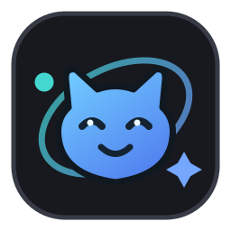
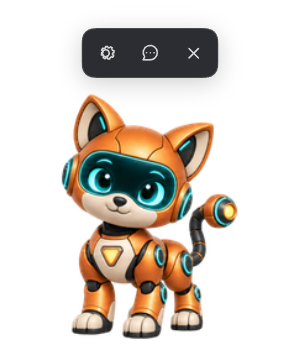
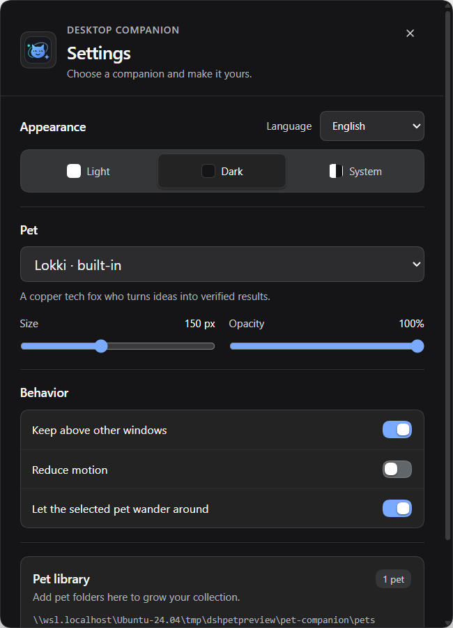
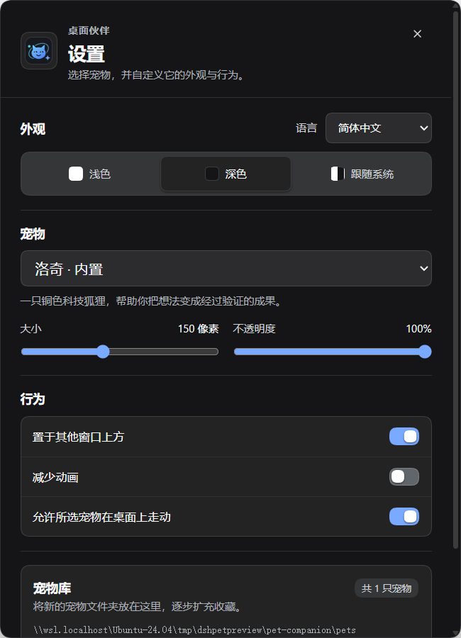

# DSH Pet Companion

<p align="center">
  
</p>

A floating desktop pet for DeepSeek Harness. It reacts to agent activity in a separate transparent window and includes a folder-based library for adding pets from animated atlases or transparent portraits. The bundled collection currently includes Lokki and Professor Leo, and the folder-based library supports adding more pets.

## Screenshots

<table>
  <tr>
    <th align="center">Companion and hover controls</th>
    <th align="center">Settings in English</th>
    <th align="center">Settings in Simplified Chinese</th>
    <th align="center">Professor Leo</th>
  </tr>
  <tr>
    <td align="center"></td>
    <td align="center"></td>
    <td align="center"></td>
    <td align="center"></td>
  </tr>
</table>

## Built-in pets

Professor Leo is a curious lion scientist with a copper mane, teal glasses, and a white lab coat. He brings a researcher's curious, thoughtful personality to the companion collection. His name and description follow the English or Simplified Chinese DSH locale.

## What it does

- Displays the selected pet in its own movable desktop window, including when DSH is minimized.
- Switches between idle, working, waiting or review, and error poses as DSH agent events change.
- Provides hover controls for Settings, a text composer, and Close pet. Right-clicking the pet opens a menu with Settings, Next pet, and Close pet.
- Lets the DSH sidebar's **Show pet** switch hide or restore the companion while leaving the plugin enabled. Closing the pet also turns this switch off.
- Offers appearance, language, size, opacity, always-on-top, reduced-motion, and wandering settings.
- Follows DSH's English or Chinese locale by default; the language can also be selected in Settings.
- Includes Lokki, a copper tech fox, and Professor Leo, a curious lion scientist. Both ship with Hatch-Pet v2 animation atlases and English and Simplified Chinese labels.
- Loads additional pet folders without rebuilding or reinstalling the plugin. A single transparent portrait can be used without creating an animation atlas.

## Install and remove

```sh
dsh plugin --profile web add github:hasan-aghayev/dsh-pet-companion
```

Change web to the DSH profile you use. On first start, the companion downloads its pinned Electron runtime and opens a desktop window. A graphical desktop is required; WSL2 users need WSLg enabled.

To remove the plugin:

```sh
dsh plugin --profile web remove dsh-pet-companion
```

Disabling the plugin in DSH stops its desktop process but keeps it installed. Hiding the pet with **Show pet** only changes visibility. Pet files and preferences remain under $DSH_HOME/pet-companion after removal, so they are available if you install the plugin again.

## Settings and controls

Open Settings with the gear button or by double-clicking the pet. Use **Show pet** in the DSH sidebar to bring a hidden companion back. The **Close pet** control hides the companion and turns off **Show pet**; the plugin remains enabled.

The text composer sends the entered message to the most recently active live DSH session through DSH's public agent API. It does not show a session picker. Press Enter to send and Shift+Enter to add a line.

## Add another pet

Open the **Pet library** folder from Settings. Add one folder for each pet, with a pet.json manifest and its artwork inside. The folder name must match the manifest's id. New folders are discovered automatically within a few seconds; **Refresh** rescans the library immediately.

### Hatch-Pet v2 animation atlas

Use a 1536 x 2288 pixel atlas (8 columns by 11 rows) and set spriteVersionNumber to 2:

```json
{
  "id": "miso",
  "displayName": "Miso",
  "description": "A small lunar cat.",
  "spriteVersionNumber": 2,
  "spritesheetPath": "spritesheet.webp"
}
```

Optional displayNameZh and descriptionZh fields provide Simplified Chinese labels. Hatch-Pet v2 uses its standard animation rows, including idle, walking, waving, jumping, failed, waiting, working, and review poses, plus 16 look directions.

### Transparent portrait

A single PNG or WebP can be used without an animation atlas. Portraits get a gentle breathing motion:

```json
{
  "id": "miso-portrait",
  "displayName": "Miso",
  "description": "A portrait with gentle motion.",
  "format": "portrait",
  "imagePath": "portrait.png"
}
```

Names may use lowercase letters, digits, and hyphens. Image paths must stay inside the pet folder. Images must be no larger than 25 MiB; portrait dimensions can be up to 4096 x 4096 pixels. Built-in pet IDs are reserved.

## Data and privacy

Pet art, preferences, window position, and session IDs stay on the local machine. The plugin observes DSH agent lifecycle and approval or question events to select an animation. It does not read conversation text, files, or credentials. Text submitted from the composer is sent only to the selected live DSH session through DSH's public agent API. The plugin downloads the pinned Electron runtime on first start and makes no other network requests itself.

## Development

```sh
pnpm install
pnpm check
```

The package contains ready-to-run JavaScript and static desktop files, so it needs no install-time build script. The root package.json declares the dsh.bundle manifest in cordis.patch.yml.

## License

MIT. The Lokki sprite art is included with permission from its creator, Hasan Aghayev. The Professor Leo sprite art was generated for this repository and is included in the plugin package. Do not redistribute Lokki artwork separately from this plugin without permission.
